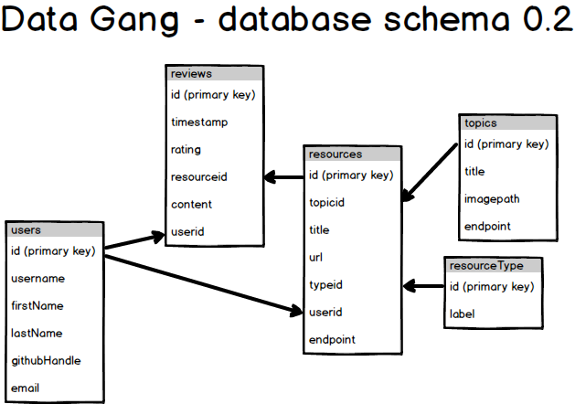

# data-gang

Problem:  
FAC members share resources (i.e. articles, videos, tutorials, etc.) with each other on gitter. But resources shared a while ago are likely to get lost. It would be good to have a place to store them.  
We have the notes repo, but adding a new resource is too time consuming. A repo format is also not very useful for searching or accessing resources suggested by others.

Solution:  
A website where FAC members can upload, access and review all our favourite resources.

1. [How to run our website on your local machine](#how-to-run-our-website-on-your-local-machine)
2. [User stories](#user-stories)
3. [Project plan](#project-plan)
4. [Schema](#schema)
5. [Endpoints](#endpoints)
6. [Features](#features)

## How to run our website on your local machine
- Clone our repo & `cd` into the data_gang folder
- Run `npm install` in your terminal
- Log in to psql and create new database
- Add a `config.env` file to the root directory (ask one of us for the contents, if you think we will trust you :O)
- Run `npm start`

## User stories
**As** a member of the current FAC cohort,  
**I want to** find the best resource by topic,  
**so that** I can extend my learning each week.

Journey:  
Homepage -> click on topic -> resources page (-> choose filter) -> click on resource title

**As** a member of the current FAC cohort,  
**I want to** share and review resources with my fellow FACers,  
**so that** we can learn collaboratively.

Journey:  
Homepage -> click "add" button -> createResource page -> fill in form, click submit -> homepage? view my uploaded resource?

**As** a member of the current FAC cohort,  
**I want to** have access to the resources that previous cohorts have found useful,  
**so that** we can build on each others' learning experiences.

_retain the same database - don't create a new one each FAC_

**As** a member of the FAC alumni,  
**I want to** found out what the current/previous FACers found useful,  
**so that** I can build an iteratively better programme for the cohort that I'm teaching.

_enable more than just the current cohort to have access_

### Sub stories
**As** a busy FACer who doesn't have much time,  
**I want to** share my resource as quickly as possible,  
**so that** I can get back to building my project asap.  

_"add" button should be clearly visible on the homepage_

**As** someone lagging behind on a particular week,  
**I want to** find the best resource(s),  
**so that** I can catch up to the rest of the group asap.

_should be able to find resources based on recommendation (e.g. rating, review)_

**As** someone who trusts a particular cohort member's opinion on a topic,  
**I want to** see all the resources and/or reviews subitted by that member,  
**so that** I can gain from their wisdom and become as good as them.

_list only the resources that have been uploaded/reviewed by a particular user_

## Project plan
### Tuesday
#### Morning
Choose Idea
User stories
Wireframing
Features
Schema

#### Afternoon
Get environment set up:
File structure
Install dependencies - hapi, handlebars, pg
Initialise database

### Wednesday
#### Morning
Integrate index.js, db_build.js & db_build.sql - make sure `node index.js` works as expected
Create route & handler for '/' endpoint
Create helper function (queries.js) to use in handler

#### Afternoon
Create route & handler for rest of endpoints (apart from login & logout):
- '/{topicsEndpoint}' resources by topic
- '/{topicsEndpoint}/{resourceEndpoint}' all reviews on specific resource
- '/recent' shows all reviews, by all users, in time order - most recent review first
- '/users/{Username}' all reviews written by this user
- '/createResource' form for user to add new resource
- '/createReview/{resourceEndpoint}' form for user to add their review
- '/editResource'
- '/editReview'

### Thursday

## Schema

## Endpoints
Implemented:
- GET :: /                                      Landing page
- GET :: /login                                 Login page - enter username & password
- POST :: /login/submit                         Successful login re-routes user to logged-in version of homepage
- GET :: /register                              Registration form
- POST :: /register/submit                      Adds new entry to users table in database, re-routes user to logged-in version of homepage
- GET :: /logout                                Reroutes user to homepage, where they can no longer add a resource
- GET :: /{topic_endpoint}                      Shows all resources associated with a particular topic  
- GET :: /{topic_endpoint}/{resource_endpoint}  Shows all reviews associated with a particular topic  
- GET :: /create-resource                       Show form for adding a resource to the website
- POST :: /create-resource/submit               Adds resource to the website, redirects to /{topic_endpoint}
- GET :: /edit-resource                         Show form for editing a user's own resource (same as form to add resource, but input fields are populated with current entries)
- POST :: /edit-resource/submit                 Updates user's resource, redirects to /{topic_endpoint}
- GET :: /create-review                         Show form for adding a review to the website
- POST :: /create-review/submit                 Adds review to website, redirects user to /{topic_endpoint}/{resource_endpoint}

To be implemented:
- /reviews/recent                               Shows all reviews, by all users, in time order - most recent review first  
- /users/{username}                             Shows all resources that have been uploaded/reviewed by a specific user

## Features:
- I can log in.
- I can see a list of resources.
- I can see a list of recently uploaded resources.
- I can create, edit and view my own resources & reviews.
- I can see a list of reviews of a particular resource.
- (optional extra) I can see a list of resources/reviews by a particular user.
